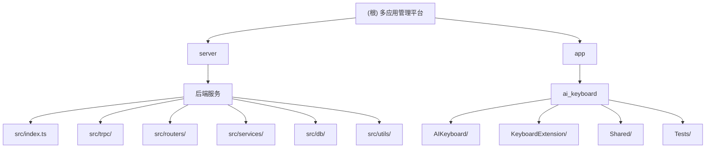

# CLAUDE.md

This file provides guidance to Claude Code (claude.ai/code) when working with code in this repository.

## 变更记录 (Changelog)

- **2026-02-13 18:40:03** - AI 上下文初始化
  - 添加 Mermaid 模块结构图
  - 更新模块索引表格
  - 添加 AI 使用指引章节
  - 优化项目概述和架构说明

## 项目概述

这是一个多应用管理平台，采用 monorepo 结构：
- **server/** - Node.js 后端服务，为多个 iOS 应用提供统一的管理后台和 API
- **app/ai_keyboard/** - iOS 客户端应用（AI Keyboard），包含主应用和键盘扩展

当前主要应用为 AI Keyboard：一款智能风格化回复键盘，用户预设说话风格后，键盘自动读取剪贴板内容并生成个性化回复。

## 架构总览

### 模块结构图



### 模块索引

| 模块 | 路径 | 类型 | 语言 | 入口文件 | 包管理器 | 测试 |
|------|------|------|------|----------|----------|------|
| 后端服务 | `server/` | 后端 API | TypeScript | `src/index.ts` | pnpm | 暂无 |
| AI Keyboard | `app/ai_keyboard/` | iOS 应用 | Swift | `AIKeyboard/App/AIKeyboardApp.swift` | Xcode | `Tests/AIKeyboardTests.swift` |

## 开发环境设置

### 后端环境
1. **Node.js 20+** 和 **pnpm**（包管理器）
2. **PostgreSQL 15+** 数据库
3. 复制环境变量模板：
   ```bash
   cd server
   cp .env.example .env  # 若无模板，参考现有 .env 结构
   ```
   必需变量：`DATABASE_URL`（PostgreSQL 连接字符串）、`PORT`、`HOST`、`JWT_SECRET`

### 前端环境
1. **Xcode 15.0+** 和 **iOS 16.0+** SDK
2. 有效的 Apple 开发者账号（用于键盘扩展签名）

## 常用命令

### 后端开发
```bash
cd server

# 安装依赖
pnpm install

# 开发模式（热重载）
pnpm dev

# 构建生产版本
pnpm build

# 运行生产版本
pnpm start

# 数据库迁移
pnpm db:generate    # 根据 schema.ts 生成迁移文件
pnpm db:migrate     # 执行迁移
pnpm db:push        # 直接推送 schema 到数据库（开发用）
pnpm db:studio      # 打开 Drizzle Studio 数据库管理界面
```

### 前端开发
```bash
cd app/ai_keyboard

# 使用 Xcode 打开项目
open AIKeyboard.xcodeproj

# 或使用 xcodebuild 命令行构建
xcodebuild -project AIKeyboard.xcodeproj -scheme AIKeyboard -destination 'platform=iOS Simulator,name=iPhone 15'

# 运行单元测试
xcodebuild test -project AIKeyboard.xcodeproj -scheme AIKeyboard -destination 'platform=iOS Simulator,name=iPhone 15'
```

## 架构概述

### 后端架构（server/）
- **Web 框架**: Fastify + tRPC（类型安全的 RPC 框架）
- **数据库 ORM**: Drizzle ORM（PostgreSQL）
- **认证层级**:
  - `publicProcedure` - 无需认证
  - `appProcedure` - 需要有效的 `x-api-key`（App 级别）
  - `protectedProcedure` - 需要 `x-api-key` + `x-device-id`（用户级别）
  - `adminProcedure` - 管理员认证（简易 Token 方案，可升级为 JWT）
- **多租户设计**: 支持多个独立应用（App）的数据隔离，每个 App 有自己的 API Key 和配置
- **核心数据模型**:
  - `admins` - 管理员账户
  - `apps` - 应用注册表（多 App 管理）
  - `subscriptionPlans` - 订阅计划（每个 App 可自定义）
  - `users` - 用户（按 App 隔离）
  - `subscriptions` - 用户订阅状态
  - `styles` - 说话风格配置
  - `usageRecords` - 使用量统计

### 前端架构（app/ai_keyboard/）
- **开发语言**: Swift 5.9+
- **UI 框架**: SwiftUI（主应用）+ UIKit（键盘扩展）
- **最低版本**: iOS 16.0+
- **应用内购买**: StoreKit 2
- **项目结构**:
  - `AIKeyboard/` - 主应用（Host App）
  - `KeyboardExtension/` - 键盘扩展
  - `Shared/` - 主应用与扩展共享代码
  - `Tests/` - 单元测试
- **数据共享**: App Group Container（主应用与键盘扩展之间）
- **架构模式**: MVVM

### 路由结构（tRPC）
```
admin.*               - 管理员认证与管理（管理后台）
app.*                 - 应用 CRUD 管理
subscriptionManage.*  - 订阅计划与用户订阅管理
user.*                - 用户注册与认证（客户端 API）
ai.*                  - AI 回复生成
style.*               - 说话风格管理
subscription.*        - 订阅查询与验证
```

## 运行与开发

### 后端启动流程
1. 配置环境变量（`.env` 文件）
2. 安装依赖：`pnpm install`
3. 启动开发服务器：`pnpm dev`
4. 访问 `http://localhost:3000/health` 检查服务状态

### 前端启动流程
1. 打开 Xcode 项目：`open AIKeyboard.xcodeproj`
2. 选择目标设备（模拟器或真机）
3. 运行项目（Cmd+R）
4. 键盘扩展需要单独启用：设置 → 通用 → 键盘 → 添加新键盘

## 测试策略

### 前端测试
- 单元测试位于 `app/ai_keyboard/Tests/AIKeyboardTests.swift`
- 测试内容：说话风格、风格组合、订阅状态、字符串和颜色扩展等
- 运行方式：Xcode 中按 `Cmd+U` 或使用 `xcodebuild test` 命令

### 后端测试
- 目前未配置自动化测试框架
- 可通过 `curl` 或 tRPC 客户端测试 API

## 编码规范

### TypeScript 规范
- 使用 TypeScript 严格模式
- 接口和类型定义优先使用 `interface`
- 异步函数使用 `async/await`
- 错误处理使用 `try/catch` 或 tRPC 错误机制

### Swift 规范
- 遵循 Swift API 设计指南
- 使用 SwiftUI 声明式语法
- 状态管理使用 `@StateObject` 和 `@EnvironmentObject`
- 网络请求使用 `async/await`

## AI 使用指引

### 后端开发
- **数据库操作**: 使用 Drizzle ORM，schema 定义在 `src/db/schema.ts`
- **API 开发**: 使用 tRPC 路由，遵循认证层级（public/app/protected/admin）
- **错误处理**: 使用 `TRPCError` 抛出标准错误
- **多租户**: 所有业务数据按 `appId` 隔离

### 前端开发
- **网络请求**: 使用 `APIConfig.swift` 中的配置
- **数据共享**: 主应用与键盘扩展通过 App Group 共享数据
- **状态管理**: 使用 `@StateObject` 管理服务类实例
- **键盘扩展**: 注意权限配置和内存限制

### 常见任务
1. **添加新 API**: 在 `src/routers/` 创建新路由，在 `src/trpc/router.ts` 注册
2. **修改数据库**: 更新 `src/db/schema.ts`，运行 `pnpm db:generate` 和 `pnpm db:migrate`
3. **添加新功能**: 在 `src/services/` 创建服务类，在路由中调用
4. **iOS 新页面**: 在 `AIKeyboard/Views/` 创建 SwiftUI 视图

## 关键文件

### 后端
- `server/src/index.ts` - 服务入口，Fastify 服务器配置
- `server/src/trpc/router.ts` - tRPC 根路由定义
- `server/src/trpc/index.ts` - tRPC 中间件和 procedure 定义
- `server/src/db/schema.ts` - 数据库 schema 定义（Drizzle ORM）
- `server/src/routers/` - 各业务模块的路由器
- `server/drizzle.config.ts` - Drizzle Kit 配置
- `server/.env` - 环境变量（不提交到版本控制）

### 前端
- `app/ai_keyboard/project.yml` - Xcode 项目配置（XcodeGen）
- `app/ai_keyboard/AIKeyboard.xcodeproj` - Xcode 项目文件
- `app/ai_keyboard/Tests/AIKeyboardTests.swift` - 单元测试示例

## 部署说明

### 后端部署
1. 构建生产版本：`pnpm build`
2. 启动服务：`pnpm start`
3. 需要 PostgreSQL 数据库连接
4. 建议使用进程管理器（如 PM2）或容器化部署

### 前端部署
1. 使用 Xcode Archive 功能打包
2. 通过 App Store Connect 提交审核
3. 键盘扩展需要特殊权限配置

## 注意事项

1. **数据库迁移**：修改 `schema.ts` 后必须运行 `pnpm db:generate` 和 `pnpm db:migrate`
2. **API 密钥**：每个客户端 App 需要在 `apps` 表中注册，获取唯一的 `apiKey` 和 `apiSecret`
3. **环境隔离**：开发、测试、生产环境使用不同的数据库和 `.env` 配置
4. **键盘扩展权限**：需要启用 "Allow Full Access" 才能读取剪贴板
5. **多 App 支持**：系统设计支持管理多个独立应用，当前主要为 AI Keyboard 服务

## 快速参考

### 创建新 App（管理后台）
1. 在 `apps` 表中插入新记录，生成 `apiKey` 和 `apiSecret`
2. 配置订阅计划（`subscriptionPlans` 表）
3. 客户端使用分配的 `apiKey` 调用 API

### 初始化管理员
```bash
# 通过 tRPC 调用 admin.init 过程
# 或直接向 /trpc/admin.init 发送 POST 请求
```

### 检查服务健康
```bash
curl http://localhost:3000/health
```