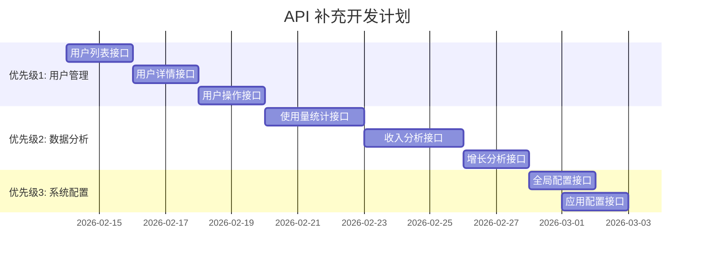

# API 功能缺陷报告 - 管理后台支持

## 📋 文档概述

### 目的
本报告旨在识别当前后端 API 对管理后台功能支持的不足，并提供具体的接口补充建议。管理后台（admin/）需要完整的用户管理、数据分析和系统配置功能，当前 API 在这些方面存在显著缺失。

### 评估基准
- **评估时间**：2026-02-13
- **评估版本**：0.6.0（基于 API_DOCUMENTATION.md v1.0.0）
- **总接口数**：45 个（tRPC 接口 44 个 + 健康检查 1 个）
- **评估范围**：管理后台（admin/）所需的所有功能

### 当前状态总结
现有 API 在核心 CRUD 操作（应用管理、订阅计划）方面表现良好，但在用户管理、数据分析和系统配置方面存在重大缺失。总体满足度约 **65%**。

## 📊 功能匹配度分析

| 功能模块 | 匹配度 | 现有接口 | 缺失功能 |
|---------|--------|----------|----------|
| **管理员认证** | ✅ 100% | `admin.login` `admin.create` `admin.me` `admin.refresh` `admin.init` | 无缺失 |
| **多应用管理** | ✅ 100% | `app.create` `app.list` `app.detail` `app.update` `app.regenerateKey` `app.delete` | 无缺失 |
| **用户管理** | ⚠️ 40% | 无直接接口 | 用户列表、详情、搜索、禁用/启用、密码重置 |
| **订阅管理** | ✅ 80% | `subscriptionManage.*` 系列接口 | 收入统计、详细转化分析、退款处理 |
| **数据分析** | ⚠️ 30% | `subscriptionManage.stats` | 使用量统计、用户增长、收入趋势、漏斗分析 |
| **平台设置** | ❌ 10% | 无相关接口 | 全局配置、应用级别设置、邮件模板管理 |

## 🚨 优先级分类

### 🔴 优先级 1（必须补充）
**用户管理模块**：管理后台无法查看和管理用户是核心功能缺失

### 🟡 优先级 2（重要补充）
**数据分析模块**：管理后台需要数据仪表盘支持决策

### 🟢 优先级 3（优化补充）
**系统配置模块**：平台级和应用级配置管理

## 🔍 详细缺失接口列表

### 优先级 1：用户管理接口

#### 1. 用户列表查询
**用途**：管理后台查看指定应用的所有用户，支持分页、搜索和筛选

```typescript
// 接口名称: user.list
// 认证层级: adminProcedure
// 方法: GET
// 路径: /trpc/user.list

// 请求参数
{
  appId: string;                    // 应用ID（必需）
  search?: string;                  // 搜索关键字（邮箱/设备ID）
  email?: string;                   // 邮箱精确匹配
  deviceId?: string;                // 设备ID精确匹配
  status?: "active" | "disabled";   // 用户状态筛选
  emailVerified?: boolean;          // 邮箱验证状态筛选
  hasSubscription?: boolean;        // 是否有订阅
  tier?: "free" | "pro_monthly" | "pro_yearly";  // 订阅套餐筛选
  limit?: number;                   // 每页数量，默认20
  offset?: number;                  // 偏移量，默认0
  sortBy?: "createdAt" | "lastActiveAt" | "email";  // 排序字段
  sortOrder?: "asc" | "desc";       // 排序方向，默认desc
}

// 响应格式
{
  items: Array<{
    user: User;                     // 用户基本信息
    subscription: Subscription | null;  // 当前订阅（如有）
    stats: {
      totalRequests: number;        // 总AI请求次数
      lastActiveAt: Date | null;    // 最后活跃时间
    }
  }>;
  total: number;                    // 总用户数
  limit: number;
  offset: number;
  filters: {                        // 当前筛选条件统计
    active: number;
    disabled: number;
    emailVerified: number;
    hasSubscription: number;
  }
}
```

#### 2. 用户详情查看
**用途**：查看单个用户的完整信息，包括订阅历史、使用记录等

```typescript
// 接口名称: user.detail
// 认证层级: adminProcedure
// 方法: GET
// 路径: /trpc/user.detail

// 请求参数
{
  userId: string;  // 用户ID（必需）
}

// 响应格式
{
  user: User & {
    app: {                          // 所属应用信息
      id: string;
      name: string;
    }
  };

  // 订阅信息
  subscription: Subscription | null;
  subscriptionHistory: Array<{
    subscription: Subscription;
    plan: SubscriptionPlan;
    activatedAt: Date;
    cancelledAt?: Date;
    expiresAt: Date;
  }>;

  // 使用统计
  usageStats: {
    totalRequests: number;          // 总请求次数
    todayRequests: number;          // 今日请求
    monthlyRequests: number;        // 本月请求
    firstRequestAt: Date | null;    // 首次使用时间
    lastRequestAt: Date | null;     // 最后使用时间
    favoriteStyles: Array<{         // 最常使用的风格
      styleId: string;
      styleName: string;
      count: number;
    }>;
  };

  // 设备信息
  devices: Array<{
    deviceId: string;
    platform?: string;
    lastSeen: Date;
    isCurrent: boolean;
  }>;
}
```

#### 3. 用户状态操作
**用途**：管理员对用户进行启用/禁用、密码重置等操作

```typescript
// 3.1 禁用用户
// 接口名称: user.disable
// 认证层级: adminProcedure
// 方法: POST
{
  userId: string;
  reason?: string;  // 禁用原因
}

// 3.2 启用用户
// 接口名称: user.enable
// 认证层级: adminProcedure
// 方法: POST
{
  userId: string;
}

// 3.3 重置用户密码
// 接口名称: user.resetPassword
// 认证层级: adminProcedure
// 方法: POST
{
  userId: string;
  sendEmail?: boolean;  // 是否发送重置邮件
}

// 3.4 手动验证邮箱
// 接口名称: user.verifyEmailManually
// 认证层级: adminProcedure
// 方法: POST
{
  userId: string;
}
```

### 优先级 2：数据分析接口

#### 1. 使用量统计分析
**用途**：查看AI使用量趋势、热门时间段、用户行为分析

```typescript
// 接口名称: analytics.usage
// 认证层级: adminProcedure
// 方法: GET
// 路径: /trpc/analytics.usage

// 请求参数
{
  appId: string;
  period: "day" | "week" | "month" | "quarter" | "year";  // 统计周期
  dateFrom?: string;  // 自定义开始日期（YYYY-MM-DD）
  dateTo?: string;    // 自定义结束日期
}

// 响应格式
{
  overview: {
    totalRequests: number;          // 总请求数
    uniqueUsers: number;            // 独立用户数
    avgRequestsPerUser: number;     // 人均请求数
    peakHour: string;               // 高峰时段（如 "14:00-15:00"）
  };

  trends: Array<{                  // 时间趋势数据
    date: string;                  // 日期（YYYY-MM-DD）
    requests: number;              // 当日请求数
    users: number;                 // 当日活跃用户
    avgResponseTime: number;       // 平均响应时间（ms）
  }>;

  hourlyDistribution: Array<{      // 24小时分布
    hour: number;                  // 0-23
    requests: number;
    percentage: number;            // 占比百分比
  }>;

  topUsers: Array<{                // 高用量用户
    userId: string;
    email: string;
    requests: number;
    lastActive: Date;
  }>;

  topStyles: Array<{               // 热门风格
    styleId: string;
    styleName: string;
    usageCount: number;
    percentage: number;
  }>;
}
```

#### 2. 收入与订阅分析
**用途**：收入统计、订阅转化率、用户生命周期价值分析

```typescript
// 接口名称: analytics.revenue
// 认证层级: adminProcedure
// 方法: GET
// 路径: /trpc/analytics.revenue

// 请求参数
{
  appId: string;
  period: "month" | "quarter" | "year";
  currency?: string;  // 货币筛选，默认所有
}

// 响应格式
{
  summary: {
    totalRevenue: number;          // 总收入（分）
    activeSubscriptions: number;   // 活跃订阅数
    mrr: number;                   // 月度经常性收入
    arr: number;                   // 年度经常性收入
    avgRevenuePerUser: number;     // 用户平均收入
  };

  revenueTrends: Array<{           // 收入趋势
    period: string;                // 周期标识（如 "2026-01"）
    revenue: number;               // 当期收入
    newSubscriptions: number;      // 新增订阅
    cancellations: number;         // 取消订阅
    netGrowth: number;             // 净增长
  }>;

  planPerformance: Array<{         // 套餐表现
    planId: string;
    planName: string;
    tier: string;
    activeSubscriptions: number;
    totalRevenue: number;
    churnRate: number;             // 流失率
  }>;

  conversionFunnel: {              // 转化漏斗
    totalUsers: number;
    freeUsers: number;
    trialUsers: number;
    payingUsers: number;
    conversionRates: {
      freeToTrial: string;         // 免费转试用率
      trialToPaid: string;         // 试用转付费率
      overall: string;             // 总转化率
    }
  };
}
```

#### 3. 用户增长与留存分析
**用途**：新用户增长、用户留存率、激活分析

```typescript
// 接口名称: analytics.growth
// 认证层级: adminProcedure
// 方法: GET
// 路径: /trpc/analytics.growth

// 请求参数
{
  appId: string;
  cohortPeriod?: "day" | "week" | "month";  // 同期群分组
  days?: number;  // 分析天数，默认30
}

// 响应格式
{
  dailyGrowth: Array<{            // 每日增长
    date: string;
    newUsers: number;             // 新增用户
    activeUsers: number;          // 活跃用户
    returningUsers: number;       // 回流用户
  }>;

  retentionMatrix: {               // 留存矩阵
    cohorts: Array<{               // 同期群
      cohortDate: string;          // 群组日期
      size: number;                // 群组大小
      retention: Array<number>;    // 第N日留存率（0-100%）
    }>;
  };

  acquisitionChannels: Array<{     // 获客渠道（如有）
    channel: string;
    users: number;
    conversionRate: number;
    ltv: number;                   // 生命周期价值
  }>;
}
```

### 优先级 3：系统配置接口

#### 1. 全局配置管理
**用途**：系统级配置，如邮件模板、AI提供商设置、全局开关等

```typescript
// 接口名称: settings.global
// 认证层级: adminProcedure (仅 super_admin)
// 方法: GET/POST

// 获取全局配置
GET /trpc/settings.global

// 更新全局配置
POST /trpc/settings.updateGlobal
{
  emailTemplates?: {
    verification?: {               // 邮箱验证模板
      subject: string;
      content: string;
    };
    passwordReset?: {              // 密码重置模板
      subject: string;
      content: string;
    };
    welcome?: {                    // 欢迎邮件模板
      subject: string;
      content: string;
    };
  };

  aiProviders?: {                  // AI提供商配置
    default: "openai" | "mock" | string;
    openai?: {
      apiKey: string;
      defaultModel: string;
      maxTokens: number;
    };
    // 其他提供商配置...
  };

  systemSettings?: {
    allowNewRegistrations: boolean;
    maintenanceMode: boolean;
    rateLimitPerUser: number;
    defaultUsageLimit: number;
  };
}
```

#### 2. 应用级别配置管理
**用途**：单个应用的特定配置管理

```typescript
// 接口名称: settings.app
// 认证层级: adminProcedure
// 方法: GET/POST

// 获取应用配置
GET /trpc/settings.app?appId=xxx

// 更新应用配置
POST /trpc/settings.updateApp
{
  appId: string;
  settings: {
    aiProvider?: string;
    defaultModel?: string;
    usageLimit?: number;
    maxStylesPerUser?: number;
    subscriptionRequired?: boolean;
    trialDays?: number;

    // 功能开关
    features: {
      emailVerification: boolean;
      passwordReset: boolean;
      styleSharing: boolean;
      socialLogin: boolean;
    };

    // 内容策略
    contentPolicy: {
      maxPromptLength: number;
      allowedStyles: string[];
      blockedWords: string[];
    };
  };
}
```

## 🛠️ 实施建议

### 技术实施方案

#### 1. 分阶段开发


#### 2. 数据库优化建议
- **用户列表查询**：为`users`表添加复合索引 `(appId, createdAt)` 和 `(appId, email)`
- **使用量统计**：建议创建`usage_stats`物化视图或定期聚合表
- **收入分析**：建议创建`revenue_analytics`聚合表，按日/月预计算

#### 3. 性能考虑
- **分页优化**：用户列表使用keyset分页而非offset分页
- **缓存策略**：统计数据可缓存5-30分钟，根据实时性需求调整
- **批量处理**：分析接口支持异步生成报告

### 接口设计原则

1. **一致性**：遵循现有 tRPC 错误处理、认证中间件模式
2. **灵活性**：提供丰富的筛选、排序、分页参数
3. **性能**：返回数据包含必要聚合，避免前端二次计算
4. **安全性**：严格验证权限，确保数据隔离（按 appId）

### 测试建议

1. **单元测试**：每个新接口应有完整的输入验证测试
2. **集成测试**：测试多应用数据隔离，确保用户只能访问所属应用数据
3. **性能测试**：大数据量下的列表查询和统计计算性能
4. **安全测试**：权限绕过测试，确保adminProcedure正确验证

## 📈 预期效果

### 实施后功能提升

| 功能模块 | 提升后匹配度 | 新增能力 |
|---------|-------------|----------|
| **用户管理** | ✅ 95% | 完整用户CRUD、搜索筛选、状态管理 |
| **数据分析** | ✅ 90% | 多维分析仪表盘、趋势图表、导出功能 |
| **平台设置** | ✅ 85% | 全局和应用配置管理、邮件模板编辑 |
| **总体匹配度** | ✅ **95%** | 满足管理后台所有核心需求 |

### 管理后台价值提升

1. **运营效率**：管理员可快速查看和管理所有用户
2. **数据驱动**：丰富的分析报表支持业务决策
3. **灵活配置**：无需代码修改即可调整平台参数
4. **用户体验**：更完善的后台功能提高管理效率

## 📞 后续跟进

### 验收标准
- [ ] 用户列表接口支持分页、搜索、筛选
- [ ] 用户详情包含完整信息和使用历史
- [ ] 使用量统计接口提供时间趋势数据
- [ ] 收入分析接口支持多周期对比
- [ ] 配置管理接口可实时生效

### 协作建议
1. **前端并行开发**：接口定义确定后，前端可基于TypeScript类型先行开发
2. **API文档更新**：新接口及时更新到API_DOCUMENTATION.md
3. **版本管理**：建议按优先级分批发布，减少集成风险

### 问题反馈
- 如有技术实现疑问，请及时沟通调整设计方案
- 性能或安全考虑需要特殊处理的接口请标注
- 建议每周同步开发进度，确保前后端对齐

---

**文档维护**：后端开发团队
**最后更新**：2026-02-13
**状态**：待开发补充